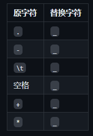
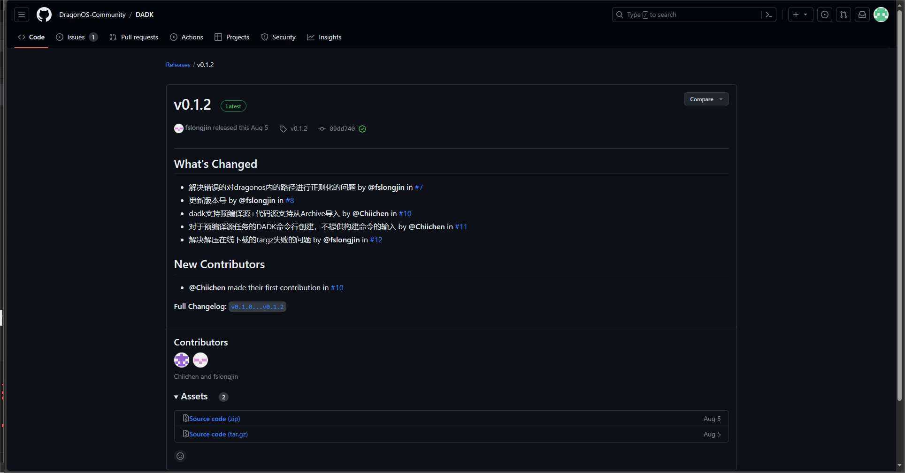
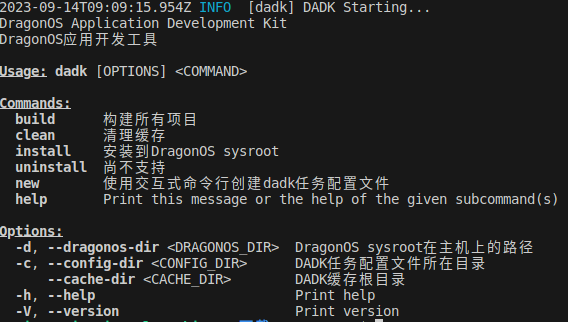
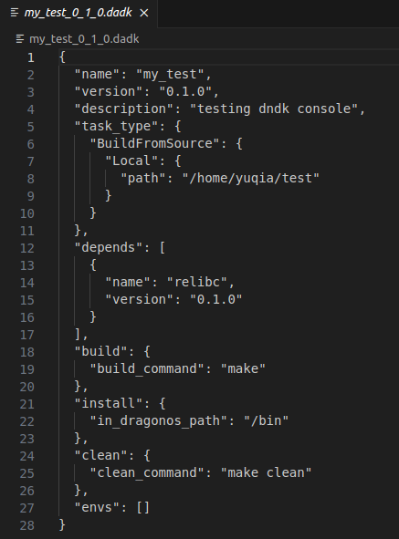

# DADK - DragonOS 应用开发工具

## 本章导读

本章意在介绍 DADK ——— 一个用于开发 DragonOS 应用的工具包，同时通过学习使用 dadk 控制台来创建配置文件。

## 什么是DADK

DADK 是一个用于开发DragonOS应用的工具包，设计目的是为了让开发者能够更加方便的开发DragonOS应用。

### DADK做什么？

* 自动配置libc等编译用户程序所需的环境
* 自动处理软件库的依赖关系
* 自动处理软件库的编译
* 一键将软件库安装到DragonOS系统中

### DADK不做什么？

* DADK不会帮助开发者编写代码
* DADK不提供任何开发DragonOS应用所需的API。这部分工作由libc等库来完成

## 工作原理

DADK 使用(任务名，任务版本)来标识每个构建目标。当使用 DADK 构建 DragonOS 应用时，DADK 会根据用户的配置文件，自动完成以下工作：

解析配置文件，生成 DADK 任务列表
根据 DADK 任务列表，进行拓扑排序。这一步会自动处理软件库的依赖关系。
收集环境变量信息，并根据 DADK 任务列表，设置全局环境变量、任务环境变量。
根据拓扑排序后的 DADK 任务列表，自动执行任务。
DADK 与环境变量
环境变量的设置是 DADK 能正常工作的关键因素之一，您可以在您的编译脚本中，通过引用环境变量，来获得其他软件库的编译信息。 这是使得您的应用能够自动依赖其他软件库的关键一步。

只要您的编译脚本能够正确地引用环境变量，DADK就能够自动处理软件库的依赖关系。

DADK会设置以下全局环境变量：

`DADK_CACHE_ROOT：DADK`的缓存根目录。您可以在编译脚本中，通过引用该环境变量，来获得 DADK 的缓存根目录。

`DADK_BUILD_CACHE_DIR_任务名_任务版本`：DADK 的任务构建结果缓存目录。当您要引用其他软件库的构建结果时，可以通过该环境变量来获得。 同时，您也要在构建您的app时，把构建结果放到您的软件库的构建结果缓存目录（通过对应的环境变量获得）中。

`DADK_SOURCE_CACHE_DIR_任务名_任务版本`：DADK 的某个任务的源码目录。当您要引用其他软件库的源码目录时，可以通过该环境变量来获得。
同时，DADK会为每个任务设置其自身在配置文件中指定的环境变量。

全局环境变量命名格式
全局环境变量中的任务名和任务版本，都会被转换为大写字母，并对特殊字符进行替换。替换表如下：



举例：对于任务libc-0.1.0，其构建结果的全局环境变量名为DADK_BUILD_CACHE_DIR_LIBC_0_1_0。

## DADK 控制台

### 获取DADK

DADK 的最新版本为 v0.1.2,可前往 <https://github.com/DragonOS-Community/DADK> 中下载。



### 补写代码

DADK 的基本组件位于 /DADK-0.1.2/src/console/elements.rs 中，在运行控制台之前，需要对其基本组件进行补全，实现相关功能，实现过程中请参考已实现函数的相关代码和注释。

>练习1：实现位于/DADK-0.1.2/src/console/elements.rs中列表选择器的 choose。

```rust
/// # 读取用户的选择
/// ## 返回值
/// * `Ok(String)` - 用户选择的选项的 ID
/// * `Err(ConsoleError)` - 用户输入的不是一个数字，或者数字不在选项列表的范围内
pub fn choose(&self) -> Result<String, ConsoleError> {
    println!("");
    if let Some(first_line_tips) = &self.first_line_tips {
        println!("{}", first_line_tips);
    }
    for item in self.items.iter().enumerate() {
        println!("\t{}. {}", item.0 + 1, item.1.description);
    }
    println!("");
    let input_tips = format!("Please input your choice:");
    let post_tips = format!("(1-{})", self.items.len());
    
    // 读取输出
    // LAB TODO BEGIN

    // LAB TODO END

    return self.parse_input(input);
}
```

>练习2：实现位于/DADK-0.1.2/src/console/elements.rs中的 parse_input。

```rust
/// # 解析用户的输入
/// 用户的输入必须是一个数字，且在选项列表的范围内.
/// ## 参数
/// * `input` - 用户的输入
/// ## 返回值
/// * `Ok(String)` - 用户选择的选项的 ID
/// * `Err(ConsoleError::InvalidInput(e))` - 用户的输入不合法
fn parse_input(&self, input: String) -> Result<String, ConsoleError> {

    // 解析输入
    // LAB TODO BEGIN

    // LAB TODO END
       
    if input < 1 || input > self.items.len() {
        return Err(ConsoleError::InvalidInput(format!(
            "Invalid input: {}, please input a number between 1 and {}",
            input,
            self.items.len()
        )));
    }
    
    Ok(self.items[input - 1].id.clone())
}
```

### 运行控制台

当补充完相关代码后，我们便可以运行DADK。

```shell
cargo run
```

会显示如下内容：



这样，DADK就可以启动了

```shell
dadk new
```


## 利用 DADK 创建配置文件

在我们开发应用程序的时候，可以手动创建编写 dadk 配置文件，也可以直接使用 DADK控制台。

使用命令`dadk new` 启动控制台

按照提示输入任务的名称、版本号、描述

```shell
Please input the [name] of the task: >> my_test
Please input the [version] of the task: >> 0.1.0
Please input the [description] of the task: >> testing dadk console
```

接着会提示你选择任务类型，可以选择新建和从预构建安装，这里我们选择 1

```shell
Please choose the [type] of the task:
        1. Build from source
        2. Install from prebuilt
Please input your choice: >> (1-2)：
```

提示选择代码来源，可以根据开发选择

```shell
Please choose the [code source] of the task:
        1. Build from git repository
        2. Build from local directory
        3. Build from archive file

Please input your choice: >> (1-3) 
```

设置软件库依赖，若没有可输入no

```shell
Please input the [dependencies] of the task:

Please one or more items.
Input more? >> (yes/no) 
```

因为我们是使用 DADK 构建 DragonOS应用，依赖于 relibc 开发，版本号 0.1.0

```shell
Please input the [dependencies] of the task:
Please input the [name] of the dependency: >> relibc
Please input the [version] of the dependency: >> 0.1.0
```

最后，按照以下输入

```shell
Note:
        1. The command will be executed in the root directory of the source code.
        2. After the command is executed, all files need to install to DragonOS should be placed in: [DADK_BUILD_CACHE_DIR_TASKNAME_VERSION]

Build Command: >> make

Please input the [install_config] of the task:
Please input the [dir to install in DragonOS] of the task: >> /bin

Please configure the [clean_config] of the task:
Please input the [clean command] of the task: >> make clean
```

这样，我们就完成了应用程序的配置文件

